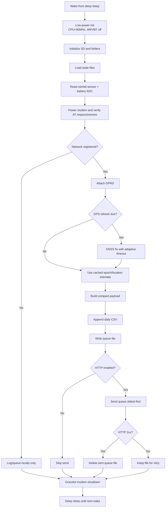
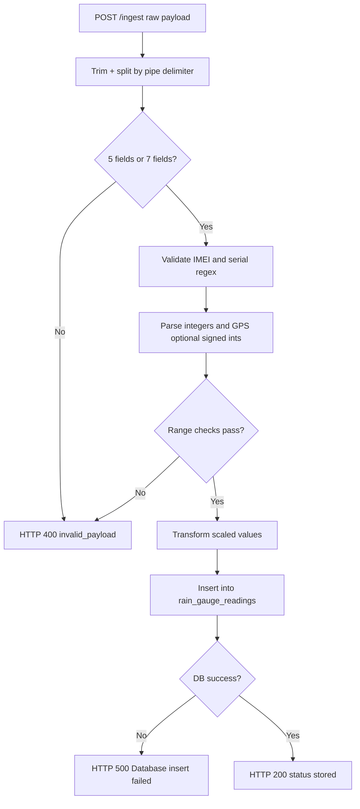

# Pavewise Rain Gauge Platform — Senior Design Final Report

## 1) Executive Summary

This repository implements an end-to-end, low-power telemetry system for rainfall monitoring in remote or distributed deployments. The system consists of:

1. **Embedded firmware** running on a LilyGo T-SIM7600 (ESP32 + SIM7600 LTE/GNSS modem).
2. **A backend ingest API** written in Flask.
3. **A PostgreSQL persistence layer** for long-term analytics and reporting.
4. **Provisioning scripts** for EC2 deployment with systemd/Gunicorn.

The core engineering goal is reliability under intermittent connectivity: the device must continue collecting measurements even when cellular transport is unavailable, and then forward backlog data when service returns. This is achieved through SD-card queueing, deterministic wake cycles, payload validation, and oldest-first retransmission.

---

## 2) System Objectives and Design Constraints

### Functional objectives
- Measure rainfall and battery health on a fixed wake interval.
- Maintain time and optional location via periodic GNSS refresh.
- Persist measurements locally in human-readable logs and machine-retry queue records.
- Deliver payloads over HTTP when enabled and network is available.
- Store validated records in PostgreSQL.

### Non-functional objectives
- **Power efficiency**: deep sleep, reduced CPU frequency, radio disablement when idle.
- **Fault tolerance**: queue persistence across outages and reboots.
- **Data integrity**: strict parser checks for numeric formatting, IMEI, serial format, and GPS bounds.
- **Operability**: reproducible EC2 setup scripts and systemd-managed services.

---

## 3) Repository Structure and Component Responsibilities

| Component | Purpose | Key files |
|---|---|---|
| Firmware (Release) | Full data acquisition + HTTP queue drain | `PavewiseRelease/PavewiseRelease.ino`, `PavewiseRelease/utilities.h` |
| Firmware (No HTTP) | Same acquisition path, transmission disabled | `PavewisenoHTTPTest/PavewisenoHTTPTest.ino`, `PavewisenoHTTPTest/utilities.h` |
| API service | Parse/validate payloads and insert into DB | `server/app.py` |
| Database schema | Reading table and index | `server/schema.sql` |
| Deployment automation | EC2 + Postgres + Gunicorn/systemd bootstrap | `server/setup_ec2_server.sh` |
| Architecture reference | High-level diagrams and deployment notes | `docs/system-architecture.md` |

---

## 4) End-to-End Functional Overview

At each wake cycle, the firmware performs a complete transactional loop in `setup()`:

1. Enter low-power operating mode (CPU downclock, Wi-Fi/BT disabled).
2. Mount SD card and verify/create required folders.
3. Load persisted state (identity cache, GPS timing, retry timing, etc.).
4. Sample rainfall and battery voltage.
5. Bring up modem and register on LTE network.
6. Determine current epoch (RTC estimate + GNSS re-anchor policy).
7. Build compact payload string.
8. Write log record and queue file to SD.
9. If HTTP enabled and online, send queued files oldest-first.
10. Power down modem and return to deep sleep.

This architecture separates **measurement correctness** from **network availability**, which is critical in field instrumentation.

---

## 5) Flow Charts

### 5.1 Device Wake-Cycle Control Flow

### 5.2 Server Ingest and Validation Flow

### 5.3 Deployment Setup Flow (EC2 Script)

```mermaid
flowchart LR
    A[Run setup_ec2_server.sh] --> B[Collect DB/user/port/path inputs]
    B --> C[Install apt packages + PostgreSQL]
    C --> D[Create/alter DB role and database]
    D --> E[Copy server files to /opt]
    E --> F[Create Python venv + pip install]
    F --> G[Apply schema.sql]
    G --> H[Write env file + systemd unit]
    H --> I[Enable/restart pavewise-ingest service]
    I --> J[Emit connection_details.txt]
```

---

## 6) Firmware Operation in Detail

## 6.1 Boot and power strategy
The firmware uses a short active window and long sleep intervals. It downclocks CPU frequency and disables radios not required for telemetry. This minimizes average power draw and extends deployment runtime.

## 6.2 Persistent state model
State is split between RTC memory and SD files:
- RTC memory tracks wake counters and epoch estimate across deep sleep.
- SD `/state` files persist critical values across full resets/power cycles (IMEI/ICCID cache, GPS fix timing, retry schedules, etc.).

This layered persistence improves resilience when devices are power-cycled or brownout conditions occur.

## 6.3 Rainfall and battery acquisition
- Rainfall is consumed as cumulative sensor output and translated into interval deltas for periodic reporting.
- Battery voltage is sampled through ADC and encoded as millivolts to avoid floating-point transport overhead.

## 6.4 Time and location strategy
GNSS is expensive in both time and energy. The system therefore:
- Re-anchors with GPS every configured refresh period (default 6 hours) or first boot.
- Adapts GNSS timeout from historical fix durations.
- Uses epoch estimation between GNSS refreshes to maintain continuity.

## 6.5 Queue-first transmission model
Every interval is committed to SD regardless of network state. Transmission is an asynchronous concern layered on top of acquisition:
- Queue file naming enforces FIFO ordering.
- Successful sends remove queue files.
- Failed sends remain for future retries.
- Invalid payload responses have bounded retention policy (drop after configured multi-day retry horizon).

This pattern is appropriate for edge telemetry where transport is non-deterministic.

---

## 7) `utilities.h` Options (Configuration Reference)

The utilities headers centralize compile-time options via `#define` macros. This section explains practical meaning and impact for each category.

## 7.1 Identity and reporting metadata
- `PAVEWISE_SERIAL_SW_VERSION` — 2-digit software version for serial number composition.
- `PAVEWISE_SERIAL_SIM_PROVIDER` — 2-digit SIM/provider code.
- `PAVEWISE_SERIAL_DEVICE_ID` — 7-digit per-device identifier.

Together these produce an 11-digit serial number (`VVPPDDDDDDD`) included in payloads and validated by the backend.

## 7.2 Cadence and timing controls
- `PAVEWISE_WAKE_INTERVAL_SECONDS` — sleep interval between acquisition cycles.
- `PAVEWISE_GPS_REFRESH_SECONDS` — GNSS re-anchor period.
- `PAVEWISE_GPS_TIMEOUT_DEFAULT_MS` / `PAVEWISE_GPS_TIMEOUT_MIN_MS` — GNSS attempt bounds.
- `PAVEWISE_GPS_RETRY_SECONDS` — failed-fix retry spacing.

Design implication: shorter intervals increase temporal resolution but also energy/network consumption.

## 7.3 HTTP behavior controls
- `PAVEWISE_ENABLE_HTTP` — compile-time transmission gate.
- `PAVEWISE_HTTP_TIMEOUT_DEFAULT_MS`, `PAVEWISE_HTTP_TIMEOUT_MAX_MS`, `PAVEWISE_HTTP_TIMEOUT_MULTIPLIER` — adaptive network timeout envelope.
- `PAVEWISE_QUEUE_INVALID_RETENTION_DAYS` (release utilities) — drop threshold for repeatedly invalid payloads.

These controls tune robustness vs. latency in unstable network conditions.

## 7.4 Queue test and simulation knobs
- `PAVEWISE_QUEUE_PRELOAD_TEST`
- `PAVEWISE_QUEUE_PRELOAD_COUNT`
- `PAVEWISE_QUEUE_PRELOAD_WEEK`

These are useful for lab validation of backlog drain behavior without waiting for real outages.

## 7.5 Cellular and endpoint settings
- `PAVEWISE_APN`, `PAVEWISE_GPRS_USER`, `PAVEWISE_GPRS_PASS`
- `PAVEWISE_SERVER_HOST`, `PAVEWISE_SERVER_PORT`, `PAVEWISE_SERVER_PATH`

These values must match carrier and backend deployment configuration.

## 7.6 Storage and retention policy
- `PAVEWISE_SD_PURGE_START_PCT` and `PAVEWISE_SD_PURGE_TARGET_PCT`

When SD utilization exceeds threshold, oldest daily logs are deleted until target usage is reached.

## 7.7 Hardware mapping and electrical interface options
- UART modem pins and baud.
- SIM7600 control pins (`PWRKEY`, `DTR`, `FLIGHT`, `STATUS`).
- Modem timing constants (boot and pulse widths).
- Battery ADC pin.
- SD SPI pin mapping.

These are deployment-critical: mismatched pin maps can cause modem bring-up failure or SD mount failures.

## 7.8 File path definitions
Macros define `/logs`, `/queue`, `/state` and individual state file names. Keeping these centralized reduces hidden coupling and simplifies migration to alternate storage layouts.

---

## 8) Payload Format and Output Semantics

## 8.1 Device output payload
Compact wire format:

`IMEI|SERIAL|BATT_MV|RAIN_X100|EPOCH[|LAT|LON]`

- Always integer tokens to reduce bytes and parser ambiguity.
- Optional GPS tokens included on GPS-refresh cycles.

Example (without GPS):
`123456789012345|01010000001|4092|15|1712678400`

Example (with GPS):
`123456789012345|01010000001|4088|25|1712682000|398123456|-846123456`

## 8.2 SD outputs
- Daily CSV logs in `/logs/log_YYYYMMDD.csv` for audit and field troubleshooting.
- Queue entries in `/queue/q_<epoch>_<wake>.txt` for retransmission.
- Operational state snapshots in `/state/*.txt`.

## 8.3 API responses
- Success: HTTP 200 with JSON `{ "status": "stored" }`
- Validation failure: HTTP 400 with code `invalid_payload` and field metadata.
- DB failure: HTTP 500 with generic insert error message.

## 8.4 Database outputs
`rain_gauge_readings` stores normalized values:
- `batt_v = BATT_MV / 1000`
- `rain_amount = RAIN_X100 / 100`
- optional decimal GPS coordinates
- `received_at` server-side ingest timestamp

This schema supports both time-series analysis and operational diagnostics.

---

## 9) Setup Documentation (Developer + Deployment)

## 9.1 Firmware setup (Arduino IDE)
1. Install ESP32 board package and select an ESP32-compatible board target.
2. Ensure required libraries are available (`TinyGSM`, `ArduinoHttpClient`, rainfall sensor dependency).
3. Open desired sketch:
   - `PavewiseRelease/PavewiseRelease.ino` for production upload.
   - `PavewisenoHTTPTest/PavewisenoHTTPTest.ino` for field logging without network transmission.
4. Edit `utilities.h` for APN, host/port/path, and serial/device identity values.
5. Compile and flash to LilyGo T-SIM7600.
6. Validate serial boot logs and SD directory creation.

## 9.2 Backend setup (manual local)
1. Create Python environment.
2. Install `server/requirements.txt`.
3. Create PostgreSQL DB and user.
4. Apply `server/schema.sql`.
5. Export required env vars (`PAVEWISE_DB_*`, `PAVEWISE_PORT`, optionally `PAVEWISE_PATH`).
6. Launch `python server/app.py` (development) or Gunicorn (production).

## 9.3 Backend setup (recommended EC2 script)
1. SSH into Ubuntu EC2 host.
2. Run `server/setup_ec2_server.sh`.
3. Provide database and service prompts.
4. Confirm systemd unit is active (`pavewise-ingest`).
5. Use generated `connection_details.txt` to update firmware server macros.

## 9.4 Operations and verification
- `curl http://<host>:<port>/health` should return status ok.
- Post sample payloads to validate parser behavior before field deployment.
- Monitor `journalctl -u pavewise-ingest -f` for runtime diagnostics.

---

## 10) Risk Analysis and Engineering Trade-offs

### Strengths
- Offline-first data durability using SD queue.
- Efficient payload representation for constrained links.
- Strict server-side validation blocks malformed data pollution.
- Repeatable infrastructure provisioning with script-driven setup.

### Limitations
- No built-in TLS/authentication in current HTTP pathway.
- Queue growth bounded only by SD capacity during prolonged outages.
- Epoch estimation can drift between GNSS anchors.
- Single-table schema is sufficient for ingest but may need extension for fleet metadata at scale.

### Recommended future enhancements
- HTTPS with certificate pinning or token-based auth.
- Queue disk quotas and smarter compaction policies.
- Fleet/device registry table keyed by IMEI/serial.
- Dashboarding (Grafana/Metabase) over stored readings.
- OTA firmware update strategy for remote maintenance.

---

## 11) Conclusion

This project demonstrates a practical edge-to-cloud telemetry architecture suited to real-world field constraints: low power, lossy connectivity, and need for eventual consistency. The implementation choices in this repository are aligned with senior-design-level system thinking: layered persistence, adaptive timing, explicit validation, and deployment automation. With modest hardening (security, observability, and scaling policies), the platform can transition from prototype to production-ready monitoring infrastructure.
