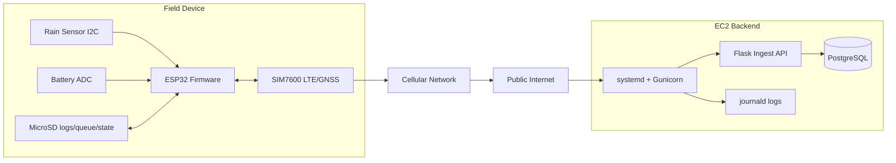
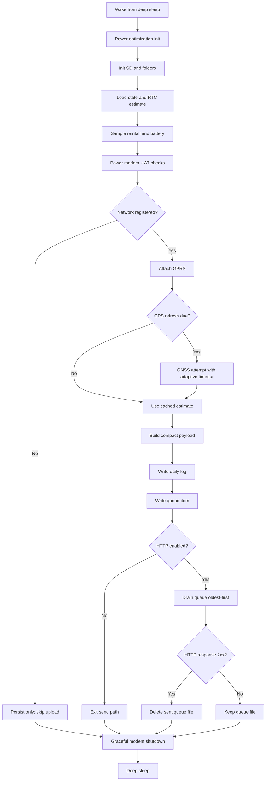
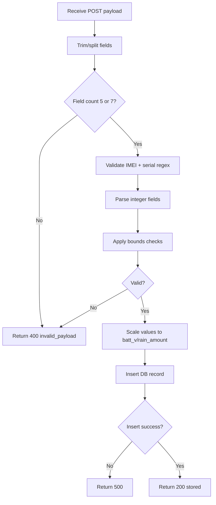

# Pavewise Rain Gauge Platform  
## Senior Design Final Technical Report

**Author context:** Senior design documentation package for an industry-sponsored project.  
**Repository:** `PavewiseRainGuage`  
**System scope:** Edge telemetry firmware + cloud ingest API + PostgreSQL data storage + EC2 deployment automation.

---

## Abstract

This report documents the architecture, operation, configuration, deployment, and expected outputs of the Pavewise Rain Gauge platform. The platform is designed for robust environmental telemetry in field conditions where power and connectivity are constrained. The embedded node samples rainfall and battery voltage, periodically refreshes GPS and time, and guarantees eventual delivery through SD-card queue persistence. The backend validates compact payloads and persists normalized readings into PostgreSQL. This document provides implementation-level detail, flow charts, setup guides, utilities configuration references, and operational trade-off analysis suitable for senior design final evaluation.

---

## Table of Contents

1. Project Overview and Problem Statement  
2. System Requirements and Constraints  
3. High-Level Architecture  
4. Hardware Subsystem Design  
5. Firmware Software Architecture  
6. Server/API Architecture  
7. Database Architecture and Data Model  
8. End-to-End Data Lifecycle  
9. Flow Charts  
10. Utilities Configuration Reference (`utilities.h`)  
11. Setup and Deployment Documentation  
12. Verification, Validation, and Test Strategy  
13. Reliability, Security, and Maintainability Analysis  
14. Performance and Power Considerations  
15. Failure Modes and Recovery Behavior  
16. Future Work and Production Hardening Recommendations  
17. Conclusion  
18. Appendix (sample payloads, runbook commands)

---

## 1) Project Overview and Problem Statement

### 1.1 Background
Roadway and infrastructure planning teams benefit from distributed rainfall telemetry in locations where wired power and network connectivity are unavailable. The project objective is to deploy a low-power gauge that can collect and forward measurements over LTE while preserving data during outages.

### 1.2 Engineering Problem
A practical field telemetry node must simultaneously satisfy:
- **Low duty-cycle power usage** to extend battery life.
- **Reliable persistence** despite poor cellular signal.
- **Strict and deterministic payload format** to avoid backend data pollution.
- **Operational simplicity** so configuration and deployment are repeatable.

### 1.3 Solution Summary
The repository implements an edge-to-cloud pipeline with these key ideas:
- ESP32 firmware performs complete measurement and queue workflows in each wake cycle.
- SD card stores both human-readable logs and machine-retry queue files.
- A Flask API validates payload structure/ranges prior to database insertion.
- PostgreSQL stores normalized values for downstream analysis.
- EC2 setup script automates backend provisioning and emits values to copy into firmware config.

---

## 2) System Requirements and Constraints

### 2.1 Functional Requirements
1. Read rainfall and battery data periodically.  
2. Maintain an epoch timestamp and optional GPS coordinates.  
3. Serialize data into compact payload format.  
4. Persist readings locally every cycle.  
5. Upload queued records when connectivity is available.  
6. Validate and store server-side readings in database.

### 2.2 Non-Functional Requirements
- **Resilience:** no data loss during short/medium LTE outages.
- **Power:** deep sleep between wake intervals.
- **Traceability:** logs on both device and server.
- **Scalability:** straightforward to replicate for multiple deployed units.

### 2.3 Environmental/Platform Constraints
- Hardware: LilyGo T-SIM7600 + DFRobot rainfall sensor.
- Firmware language/framework: Arduino C++ on ESP32.
- Backend: Python Flask + psycopg2 + Gunicorn.
- Deployment target: Linux EC2 host.

---

## 3) High-Level Architecture

### 3.1 Component Map
- **Field Node:** Sensor + ESP32 + SIM7600 + SD card.
- **Transport:** LTE/GPRS to public HTTP endpoint.
- **Cloud Service:** Flask ingest endpoint.
- **Persistence:** PostgreSQL `rain_gauge_readings` table.
- **Ops:** systemd service management, journald logs.

### 3.2 Architecture Principles
- **Edge-first persistence:** write locally before network send.
- **Fail-soft telemetry:** inability to transmit does not block acquisition.
- **Strict validation at trust boundary:** parse and range-check all incoming values.
- **Simple schema:** normalized values and ingest timestamp for analytics.

---

## 4) Hardware Subsystem Design

### 4.1 Core Hardware
- LilyGo T-SIM7600 board (ESP32 MCU + SIM7600 modem/GNSS).
- DFRobot Rainfall Sensor over I2C.
- MicroSD over SPI for persistent storage.
- Battery voltage monitor via ADC pin.

### 4.2 Relevant Pin and Interface Groups
- **UART (ESP32 ↔ SIM7600):** TX/RX macros in `utilities.h`.
- **SIM7600 control lines:** `PWRKEY`, `DTR`, `FLIGHT`, `STATUS`.
- **SD interface:** `MISO`, `MOSI`, `SCLK`, `CS`.
- **Battery ADC:** configurable analog pin (default pin 35).

### 4.3 Embedded Hardware Design Implications
- Modem control timings are critical; incorrect pulse/boot durations prevent registration.
- SD card is not optional for robust behavior because queue guarantees rely on local files.
- ADC scaling must match board divider assumptions for battery health interpretation.

---

## 5) Firmware Software Architecture

### 5.1 Firmware Variants
1. **Release build** (`PavewiseRelease/PavewiseRelease.ino`)  
   - HTTP enabled by default.
   - Includes queue send + retry + invalid-payload retention behavior.
2. **No-HTTP build** (`PavewisenoHTTPTest/PavewisenoHTTPTest.ino`)  
   - HTTP disabled; still queues and logs.
   - Useful for field checkout and sensor validation without server dependencies.

### 5.2 Control Structure
The firmware uses `setup()` as a complete wake transaction:
- Initialize runtime and peripherals.
- Acquire measurements.
- Update time/location context.
- Build payload and persist files.
- Optionally transmit queue.
- Enter deep sleep.

### 5.3 Persistent State Layers
- **RTC_DATA_ATTR variables:** survive deep sleep (not full power loss).
- **SD `/state` files:** survive full reset and battery removal.

This dual strategy balances low-overhead wake continuity and robust long-term state retention.

### 5.4 Timekeeping Strategy
- Maintain epoch estimate incremented per wake interval.
- Re-anchor using GNSS at configured refresh cadence.
- Adaptive GPS timeout based on prior successful fix duration.
- Retry GPS quickly after failures (configurable retry seconds).

### 5.5 Network and Upload Strategy
- Register modem and attach GPRS.
- If online and HTTP enabled, scan `/queue` oldest-first.
- Send each payload individually.
- Delete only after HTTP success.
- Keep failed items for later retries.

### 5.6 Storage Layout
- `/logs/log_YYYYMMDD.csv` → human-readable daily history.
- `/queue/q_<epoch>_<wake>.txt` → exactly one payload per file for replay.
- `/state/*.txt` → identity, timing, GPS retry, and related metadata.

---

## 6) Server/API Architecture

### 6.1 Service Role
The Flask API is the ingest trust boundary. It receives compact device payloads, validates strict format/range constraints, transforms scaled integer fields to engineering values, and writes records to PostgreSQL.

### 6.2 Endpoint Behavior
- `GET /health` → health probe (`{"status":"ok"}`).
- `POST /ingest` (or configured path) → payload validation + insert.

### 6.3 Parser and Validator Pipeline
1. Trim body and split by `|`.
2. Require 5 or 7 non-empty fields.
3. Validate IMEI (`15 digits`) and serial (`11 digits`) regex.
4. Parse integer fields with strict sign handling.
5. Apply range checks:
   - Battery mV bounds.
   - Non-negative rain and epoch.
   - Latitude/longitude range checks if present.
6. Convert scaled fields:
   - `batt_v = batt_mv / 1000`
   - `rain_amount = rain_x100 / 100`

### 6.4 Error Contract
- Invalid body/format/range: HTTP 400 with JSON error and invalid field code.
- DB failure: HTTP 500 generic response.
- Success: HTTP 200 `{ "status": "stored" }`.

---

## 7) Database Architecture and Data Model

### 7.1 Schema Summary
Table: `rain_gauge_readings`
- `id` (`BIGSERIAL`) primary key.
- `imei`, `serial_number` identifying metadata.
- `batt_v`, `rain_amount`, `epoch_seconds` telemetry fields.
- optional `lat_deg`, `lon_deg`.
- `received_at` server ingestion timestamp.

### 7.2 Time-Series Query Support
Index on `epoch_seconds DESC` supports recent-first dashboard queries and reporting exports.

### 7.3 Data Semantics
- `epoch_seconds` reflects device-estimated/re-anchored time.
- `received_at` reflects server ingest time.
- Difference between the two can quantify backlog delay during outages.

---

## 8) End-to-End Data Lifecycle

1. **Measurement:** sensor and battery read at wake.  
2. **Local commit:** payload logged and queued to SD.  
3. **Transport attempt:** modem online → HTTP POST oldest queue item.  
4. **Validation:** backend parser checks format/range rules.  
5. **Persistence:** successful insert into PostgreSQL.  
6. **Acknowledgment:** API returns `stored`; firmware removes queue file.

This lifecycle enforces at-least-once delivery with idempotency considerations handled at operational layer (possible duplicates can be resolved by query logic if needed).

---

## 9) Flow Charts

### 9.1 End-to-End Deployment / Networking



### 9.2 Firmware Wake-Cycle Decision Flow



### 9.3 Ingest API Parse/Validate/Store Flow



### 9.4 EC2 Provisioning Script Flow


---

## 10) Utilities Configuration Reference (`utilities.h`)

> The project contains two utilities headers (release and no-HTTP variant). Most options overlap; release includes additional invalid-payload retention control for queue cleanup.

## 10.1 Identity Macros
| Macro | Purpose | Typical Value | Effect on Output |
|---|---|---|---|
| `PAVEWISE_SERIAL_SW_VERSION` | 2-digit firmware revision code | `1` | First two serial digits |
| `PAVEWISE_SERIAL_SIM_PROVIDER` | 2-digit provider/manufacturer code | `1` | Serial digits 3-4 |
| `PAVEWISE_SERIAL_DEVICE_ID` | 7-digit unit identifier | `1` | Serial digits 5-11 |

## 10.2 Timing and Cadence Macros
| Macro | Purpose | Default | Practical Impact |
|---|---|---|---|
| `PAVEWISE_WAKE_INTERVAL_SECONDS` | Deep sleep cadence | 15 min | Sampling rate vs battery use |
| `PAVEWISE_GPS_REFRESH_SECONDS` | GNSS re-anchor period | 6 hr | Location/time freshness vs power |
| `PAVEWISE_GPS_TIMEOUT_DEFAULT_MS` | Initial GNSS timeout | 10 min | Fix success probability |
| `PAVEWISE_GPS_TIMEOUT_MIN_MS` | Minimum GNSS timeout | 3 min | Prevents too-short retries |
| `PAVEWISE_GPS_RETRY_SECONDS` | Retry delay after failure | 15 min | Recovery speed after no-fix |

## 10.3 HTTP and Queue Transport Macros
| Macro | Purpose | Default | Operational Meaning |
|---|---|---|---|
| `PAVEWISE_ENABLE_HTTP` | Enable upload path | `true` release / `false` no-HTTP | Transmission gate |
| `PAVEWISE_HTTP_TIMEOUT_DEFAULT_MS` | Base HTTP timeout | 30 s | Initial request patience |
| `PAVEWISE_HTTP_TIMEOUT_MAX_MS` | Max adaptive timeout | 60 s | Upper wait bound |
| `PAVEWISE_HTTP_TIMEOUT_MULTIPLIER` | Adaptive scaling factor | `5` | Timeout follows observed latency |
| `PAVEWISE_QUEUE_INVALID_RETENTION_DAYS` | Drop invalid payloads after repeated 400s (release) | 7 days | Bounds infinite invalid retries |

## 10.4 Queue Preload/Lab Test Macros
| Macro | Purpose | Default | Use Case |
|---|---|---|---|
| `PAVEWISE_QUEUE_PRELOAD_TEST` | Enable synthetic queue generation | `false` | Validate retry/drain behavior |
| `PAVEWISE_QUEUE_PRELOAD_COUNT` | Fixed synthetic payload count | `10` | Small regression tests |
| `PAVEWISE_QUEUE_PRELOAD_WEEK` | Generate ~week backlog | `false` | Stress backlog flush |

## 10.5 Cellular and Endpoint Macros
| Macro | Purpose | Default Example | Deployment Notes |
|---|---|---|---|
| `PAVEWISE_APN` | Carrier APN | `hologram` | Must match SIM carrier |
| `PAVEWISE_GPRS_USER` | APN username | `""` | Carrier-specific |
| `PAVEWISE_GPRS_PASS` | APN password | `""` | Carrier-specific |
| `PAVEWISE_SERVER_HOST` | Ingest host/IP | EC2 public IP | Must be reachable by device |
| `PAVEWISE_SERVER_PORT` | HTTP port | `8080` | Match backend service bind |
| `PAVEWISE_SERVER_PATH` | Ingest path | `/ingest` | Must match server route |

## 10.6 SD Storage and Retention Macros
| Macro | Purpose | Default | Impact |
|---|---|---|---|
| `PAVEWISE_SD_PURGE_START_PCT` | Begin log purge threshold | `80%` | Protects card from full state |
| `PAVEWISE_SD_PURGE_TARGET_PCT` | Stop purge threshold | `70%` | Retains headroom for queue/state |

## 10.7 Board Pin and Timing Macros
Includes UART baud, modem pins, boot/power pulse timings, ADC pin, and SD SPI mapping. These should be reviewed before board migration or custom hardware adaptation.

## 10.8 File-Path Macros
Define directory and state file naming (`/logs`, `/queue`, `/state`, identity and GPS state files). Centralizing paths reduces hidden dependencies across helper functions.

---

## 11) Setup and Deployment Documentation

## 11.1 Firmware Setup (Arduino IDE)
1. Install ESP32 board support package in Arduino IDE.
2. Ensure libraries are available:
   - TinyGSM
   - ArduinoHttpClient
   - DFRobot rainfall sensor dependency
3. Open desired sketch folder:
   - `PavewiseRelease` for production upload
   - `PavewisenoHTTPTest` for no-upload validation
4. Edit corresponding `utilities.h`:
   - APN credentials
   - `SERVER_HOST/PORT/PATH`
   - serial identity codes
5. Verify compile and flash device.
6. Confirm serial boot shows SD init and sensor read events.

## 11.2 Backend Setup (Manual)
1. Install Python and PostgreSQL.
2. Create virtual environment.
3. Install `server/requirements.txt`.
4. Create DB/user and apply `server/schema.sql`.
5. Export env vars (`PAVEWISE_DB_*`, `PAVEWISE_PORT`, `PAVEWISE_PATH`).
6. Launch with `python server/app.py` for development.

## 11.3 Backend Setup (Recommended EC2 Script)
1. SSH into Ubuntu EC2 host.
2. Execute `server/setup_ec2_server.sh`.
3. Provide prompted values (DB credentials, path, port, worker counts).
4. Confirm service:
   - `systemctl status pavewise-ingest`
   - `journalctl -u pavewise-ingest -f`
5. Copy generated connection details into firmware `utilities.h` server macros.

## 11.4 Network/Security Group Requirements
- Allow inbound TCP on configured ingest port (default 8080).
- Allow SSH (22) from admin IP only.
- Restrict PostgreSQL access; do not expose 5432 publicly unless required.

## 11.5 Post-Deployment Functional Check
- Health probe returns OK.
- Send known-good payload with curl.
- Verify inserted row in PostgreSQL.
- Confirm firmware queue drains and file deletion on success.

---

## 12) Verification, Validation, and Test Strategy

### 12.1 Unit/Parser Validation (Server)
- Valid 5-field payload should parse and store.
- Valid 7-field payload should parse GPS and store.
- Invalid IMEI/serial should return HTTP 400.
- Out-of-range lat/lon should return HTTP 400.
- DB failure path should return HTTP 500.

### 12.2 Firmware Behavioral Validation
- Boot with no network: queue growth expected; no data loss.
- Network restoration: oldest-first queue drain and deletion.
- GPS failure then success: retry and re-anchor behavior.
- SD near capacity: log purge triggers at threshold.

### 12.3 Integration Validation
- End-to-end post from device to DB row.
- Compare SD queue entries against DB inserted values.
- Verify optional GPS inclusion only on refresh cycles.

### 12.4 Acceptance Criteria Examples
- At least N wake cycles logged with no missing queue files.
- 100% of queued items uploaded after restored connectivity window.
- No malformed payload accepted into DB.

---

## 13) Reliability, Security, and Maintainability Analysis

### 13.1 Reliability Strengths
- Queue-backed eventual delivery.
- Multi-layer persisted state.
- Deterministic cycle behavior and explicit failure handling.

### 13.2 Security Observations
Current design uses plaintext HTTP by default. For production:
- Add HTTPS and server cert validation.
- Add request auth/token or device signature.
- Consider rate limiting and WAF.

### 13.3 Maintainability Strengths
- Centralized utilities macros.
- Clear script-based deployment.
- Separation of concerns between edge collection and backend validation.

### 13.4 Maintainability Risks
- Duplicate utilities across two sketch folders can drift.
- Lack of centralized CI checks for documentation and API behavior.

---

## 14) Performance and Power Considerations

### 14.1 Power Profile Drivers
- GNSS fix time is typically the largest active-power contributor.
- Cellular registration and HTTP handshake dominate communication energy.
- Deep sleep interval strongly controls average current.

### 14.2 Throughput and Latency
- Normal mode: one reading per wake interval.
- Backlog mode: throughput bounded by queue send loop and network quality.
- End-to-end latency equals queue residence time + request/DB processing time.

### 14.3 Storage Growth Considerations
- Queue can grow during outages until SD capacity limits are reached.
- Log purge policy protects capacity but trades away oldest local logs.

---

## 15) Failure Modes and Recovery Behavior

| Failure Condition | Observed Behavior | Recovery Path |
|---|---|---|
| No LTE registration | Data still logged and queued | Automatic retry next wake |
| HTTP 5xx / timeout | Queue file retained | Retry next wake |
| Invalid payload 400 | Queue retains with retention policy | File eventually dropped after retention window |
| GPS timeout | Cached epoch/location used | Retry after configured interval |
| SD near full | Oldest logs purged | Queue/state capacity preserved |
| DB unavailable | API returns 500 | Device retries via queue persistence |

---

## 16) Future Work and Production Hardening Recommendations

1. **Security hardening:** TLS, authentication, secrets rotation.  
2. **Data model expansion:** device metadata and calibration tables.  
3. **Observability:** metrics endpoint, structured logs, alerting.  
4. **Quality pipeline:** automated tests for parser edge cases and docs build checks.  
5. **Fleet operations:** OTA updates, remote config, per-device health dashboards.

---

## 17) Conclusion

The Pavewise system demonstrates a robust and practical edge telemetry architecture appropriate for real-world field deployment. The design intentionally prioritizes reliability under uncertain connectivity by coupling deterministic sampling with queue-backed transport retries. Backend validation and normalized storage complete a clean data pipeline suitable for engineering analysis and operational use. With incremental hardening (security, observability, and fleet tooling), this implementation can evolve from senior design prototype to production-grade monitoring infrastructure.

---

## 18) Appendix

### 18.1 Sample Good Payloads
- `123456789012345|01010000001|4092|15|1712678400`
- `123456789012345|01010000001|4088|25|1712682000|398123456|-846123456`

### 18.2 Sample Curl Tests
```bash
# Health
curl http://<host>:<port>/health

# Valid ingest (no GPS)
curl -X POST http://<host>:<port>/ingest \
  --data '123456789012345|01010000001|4092|15|1712678400'

# Valid ingest (with GPS)
curl -X POST http://<host>:<port>/ingest \
  --data '123456789012345|01010000001|4088|25|1712682000|398123456|-846123456'
```

### 18.3 Operational Commands
```bash
# Service status
systemctl status pavewise-ingest

# Live logs
journalctl -u pavewise-ingest -f

# Confirm table data
psql -d <db_name> -c 'select * from rain_gauge_readings order by id desc limit 10;'
```
