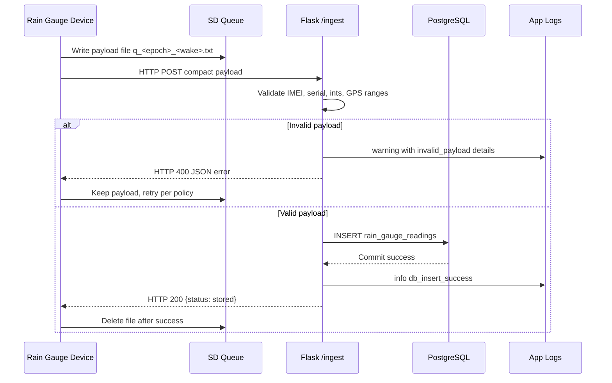

# Pavewise System Architecture

This document captures the current system architecture for the Pavewise rain gauge platform based on the release firmware, the Flask ingest service, the PostgreSQL schema, and the EC2 deployment scripts.

## 1. End-to-end deployment / networking diagram

```mermaid
flowchart LR
    subgraph Field[Field Deployment]
        RS[DFRobot Rainfall Sensor\nI2C]
        BAT[Battery ADC\nGPIO 35]
        SD[MicroSD Card\n/logs /queue /state]
        GNSS[SIM7600 GNSS]
        MCU[LilyGo T-SIM7600\nESP32 Firmware]
        LTE[SIM7600 LTE Modem\nAPN + GPRS]

        RS --> MCU
        BAT --> MCU
        SD <--> MCU
        GNSS --> MCU
        MCU <--> LTE
    end

    LTE -- HTTP POST to /ingest --> CELL[(Cellular Network)]
    CELL --> INTERNET[Public Internet]

    subgraph AWS[AWS EC2 Host]
        SG[Security Group\nAllow TCP 8080\nAllow SSH 22\nRestrict 5432]
        GUNI[Gunicorn / systemd\npavewise-ingest.service]
        API[Flask ingest API\nserver/app.py]
        PG[(PostgreSQL\nrain_gauge_readings)]
        JOURNAL[systemd journal\nheartbeat + request logs]
        DETAILS[/connection_details.txt\nserver host/port/path]

        SG --> GUNI
        GUNI --> API
        API --> PG
        GUNI --> JOURNAL
        DETAILS -. setup output .-> GUNI
    end

    INTERNET --> SG
```

### Networking notes

- The device uses the SIM7600 modem for LTE registration and GPRS data service before attempting HTTP uploads.
- The firmware posts compact payloads to the configured `PAVEWISE_SERVER_HOST`, `PAVEWISE_SERVER_PORT`, and `PAVEWISE_SERVER_PATH` values.
- The EC2 setup script provisions Gunicorn behind a systemd service and binds the Flask app to `0.0.0.0:<port>`.
- PostgreSQL is installed on the same EC2 instance by the setup script and is accessed locally by the Flask app via environment variables.

## 2. Firmware wake-cycle flow diagram

```mermaid
flowchart TD
    A[Wake from deep sleep] --> B[Reduce power usage\nCPU 80 MHz\nWiFi/BT off]
    B --> C[Mount SD card\nEnsure /logs /queue /state]
    C --> D[Load persisted state\nidentity GPS HTTP timing]
    D --> E[Read rainfall sensor\nand battery ADC]
    E --> F[Power up SIM7600\nUART + AT checks]
    F --> G{Network registered?}
    G -- No --> Q[Keep queue on SD\nLog failure state]
    G -- Yes --> H[Attach GPRS for HTTP]
    H --> I{GPS refresh due?\nfirst boot / 6h / retry}
    I -- Yes --> J[Attempt GNSS fix\nadaptive timeout]
    I -- No --> K[Use cached location\nand RTC epoch estimate]
    J --> K
    K --> L[Build compact payload\nIMEI|SERIAL|BATT_MV|RAIN_X100|EPOCH|LAT|LON]
    L --> M[Append daily CSV log]
    M --> N[Write queue file to /queue]
    N --> O{HTTP enabled and online?}
    O -- No --> Q
    O -- Yes --> P[Send queued payloads\noldest first]
    P --> R{HTTP 2xx?}
    R -- Yes --> S[Delete sent queue file\nrecord HTTP duration]
    R -- No --> T[Leave file on SD\nretry next wake]
    S --> U[Graceful modem shutdown]
    T --> U
    Q --> U
    U --> V[Deep sleep until next interval]
```

## 3. Server ingest and data flow diagram



## 4. Data ownership by subsystem

| Subsystem | Responsibility | Primary files |
| --- | --- | --- |
| Device firmware | Sampling rainfall, battery, GNSS, queueing payloads, HTTP retries, deep sleep | `PavewiseRelease/PavewiseRelease.ino`, `PavewiseRelease/utilities.h` |
| Ingest API | Parse compact payloads, validate fields, store readings, expose health endpoint | `server/app.py` |
| Database | Persist normalized readings and ingest timestamp | `server/schema.sql` |
| Provisioning | Install PostgreSQL, Gunicorn, systemd service, and environment settings on EC2 | `server/setup_ec2_server.sh` |

## 5. Trust boundaries and interfaces

1. **Sensor bus boundary**: The ESP32 trusts local I2C and ADC readings from the rainfall sensor and battery divider.
2. **Cellular/network boundary**: Payload delivery depends on LTE registration, APN access, and public internet routing.
3. **API boundary**: The Flask service validates all incoming fields before inserting into PostgreSQL.
4. **Persistence boundary**: The SD card protects field data during connectivity outages; PostgreSQL becomes the system of record after successful ingest.

## 6. Failure-handling summary

- **No cellular / HTTP outage**: payload remains on SD queue and is retried on later wake cycles.
- **GPS failure**: device falls back to cached epoch/location and retries GPS later.
- **Invalid payload**: server returns HTTP 400, firmware retains the queue item and eventually drops it after the configured invalid-payload retention window.
- **Database insert failure**: server returns HTTP 500, and the device keeps the queue file for later retry.
