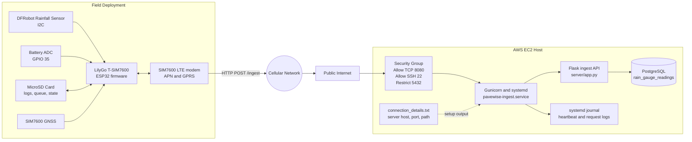
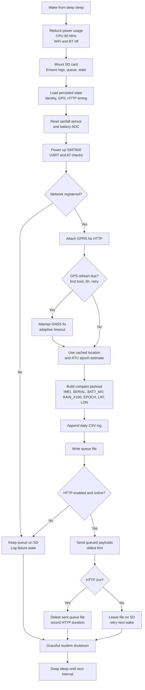
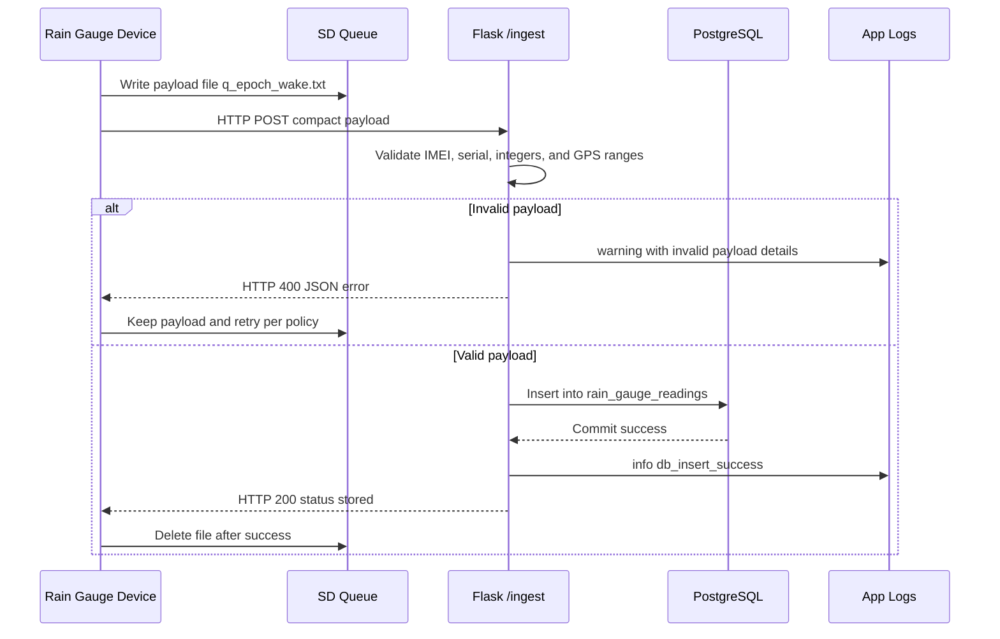

# Pavewise System Architecture

This document captures the current system architecture for the Pavewise rain gauge platform based on the release firmware, the Flask ingest service, the PostgreSQL schema, and the EC2 deployment scripts.

## 1. End-to-end deployment / networking diagram



### Networking notes

- The device uses the SIM7600 modem for LTE registration and GPRS data service before attempting HTTP uploads.
- The firmware posts compact payloads to the configured `PAVEWISE_SERVER_HOST`, `PAVEWISE_SERVER_PORT`, and `PAVEWISE_SERVER_PATH` values.
- The EC2 setup script provisions Gunicorn behind a systemd service and binds the Flask app to `0.0.0.0:<port>`.
- PostgreSQL is installed on the same EC2 instance by the setup script and is accessed locally by the Flask app via environment variables.

## 2. Firmware wake-cycle flow diagram



## 3. Server ingest and data flow diagram



## 4. Data ownership by subsystem

| Subsystem | Responsibility | Primary files |
| --- | --- | --- |
| Device firmware | Sampling rainfall, battery, GNSS, queueing payloads, HTTP retries, deep sleep | `PavewiseRelease/PavewiseRelease.ino`, `PavewiseRelease/utilities.h` |
| Ingest API | Parse compact payloads, validate fields, store readings, expose health endpoint | `server/app.py` |
| Database | Persist normalized readings and ingest timestamp | `server/schema.sql` |
| Provisioning | Install PostgreSQL, Gunicorn, systemd service, and environment settings on EC2 | `server/setup_ec2_server.sh` |

## 5. Trust boundaries and interfaces

1. **Sensor bus boundary**: The ESP32 trusts local I2C and ADC readings from the rainfall sensor and battery divider.
2. **Cellular/network boundary**: Payload delivery depends on LTE registration, APN access, and public internet routing.
3. **API boundary**: The Flask service validates all incoming fields before inserting into PostgreSQL.
4. **Persistence boundary**: The SD card protects field data during connectivity outages; PostgreSQL becomes the system of record after successful ingest.

## 6. Failure-handling summary

- **No cellular / HTTP outage**: payload remains on SD queue and is retried on later wake cycles.
- **GPS failure**: device falls back to cached epoch/location and retries GPS later.
- **Invalid payload**: server returns HTTP 400, firmware retains the queue item and eventually drops it after the configured invalid-payload retention window.
- **Database insert failure**: server returns HTTP 500, and the device keeps the queue file for later retry.

## 7. How to download these diagrams for a presentation

### Generate PDF files locally

Pull requests should stay text-only, so the PDF and PNG exports are generated on demand instead of being committed. Use the helper script below to create the presentation files in `docs/presentation-assets/`:

```bash
python -m pip install pillow
python scripts/export_architecture_diagrams.py
```

The script writes these local presentation assets:

- `presentation-assets/pavewise-system-architecture-diagrams.pdf`
- `presentation-assets/deployment-networking.pdf`
- `presentation-assets/firmware-wake-cycle.pdf`
- `presentation-assets/server-ingest-flow.pdf`

If you want the folder refreshed automatically whenever these architecture files change locally, enable the repo hook template:

```bash
git config core.hooksPath .githooks
```

### Option A: Download the Markdown file from GitHub

1. Open `docs/system-architecture.md` in the GitHub repository.
2. Click **Raw** to open the plain Markdown source.
3. Use your browser **Save As** action to download the file.

### Option B: Download the whole repository

1. In GitHub, click the green **Code** button.
2. Choose **Download ZIP**.
3. Open the ZIP and pull the file from `docs/system-architecture.md`.

### Option C: Export to PDF for slides or speaker notes

1. Open the rendered `docs/system-architecture.md` page in GitHub.
2. In your browser, choose **Print**.
3. Set the destination to **Save as PDF**.
4. Save the PDF and import it into PowerPoint, Keynote, or Google Slides.

### Option D: Copy the diagrams into presentation slides

- In GitHub, open the rendered architecture document and take screenshots of each rendered Mermaid diagram.
- Paste each screenshot into a slide, then add speaker notes or callouts around it.
- If you want cleaner slide visuals, export the page to PDF first and crop each diagram from the PDF.

### Option E: Clone locally and present from the repo

```bash
git clone https://github.com/BenOlson14/PavewiseRainGuage.git
cd PavewiseRainGuage
```

Then open `docs/system-architecture.md` in a Markdown viewer that supports Mermaid, such as GitHub, VS Code Markdown Preview, or another Mermaid-compatible renderer.

